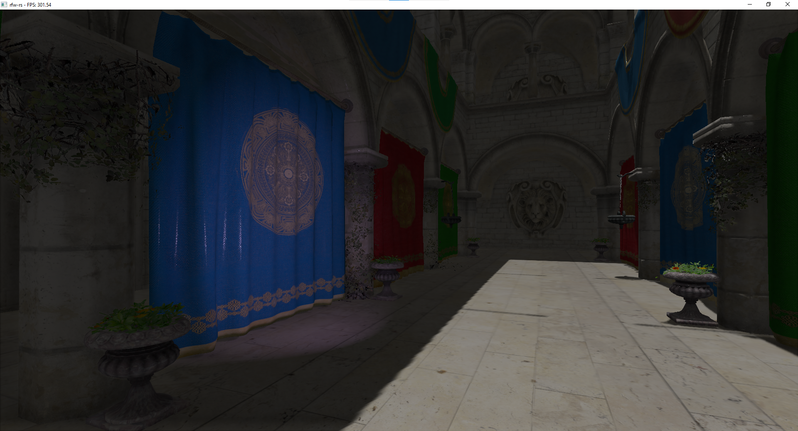
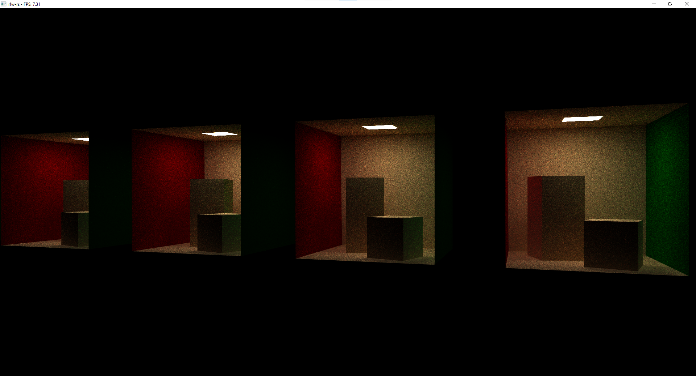

# Rust RFW
Rendering framework written in Rust.
This project is a playground for me ([@MeirBon](https://github.com/MeirBon)) to get to know Rust better and easily play around with libraries such as 
[wgpu](https://github.com/gfx-rs/wgpu) and [ash](https://github.com/MaikKlein/ash).
It is heavily based on my similarly named C++ project [rendering-fw](https://github.com/meirbon/rendering-fw).

## Todo list
- Implement an ECS-like architecture that supports user-specified types of components.
- Ability to generate various levels of lod meshes, this could be useful for shadow maps & ray traced shadows.
- Implement gltf support including animation support.
- Port my [Vulkan RTX renderer](https://github.com/meirbon/rendering-fw) to Rust.

## Features
The project currently contains the following working apps
- GPU path tracer
- Deferred GPU renderer
- Simple CPU path tracer

### scene crate
The scene library implements quads, triangle meshes, spheres and planes.
Scenes can be serialized and deserialized using [serde](https://serde.rs).
Components such as BVHs can be serialized as well allowing for quick startup times.

 