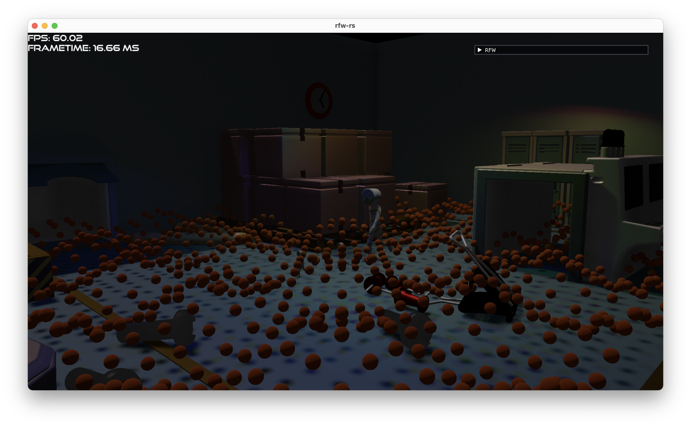

# Rust RFW
Rendering framework written in Rust.
This project is a playground for me ([@MeirBon](https://github.com/MeirBon)) to get to know Rust better and easily play around with libraries such as 
[wgpu](https://github.com/gfx-rs/wgpu) and [ash](https://github.com/MaikKlein/ash).
It is heavily based on my similarly named C++ project [rendering-fw](https://github.com/meirbon/rendering-fw).

## Features
- A powerful scene component that lets you efficiently manage 3D and 2D objects with included instancing support.
- A wgpu backend that support spot-lights, directional lights and area lights.
- Decent performance, even with >=10k instances.
- Anything that [l3d](https://github.com/meirbon/l3d) supports (currently gltf and obj files).
- Backend-agnostic font rendering powered by [glyph_brush](https://github.com/alexheretic/glyph-brush).

## TODO
- [ ] ray casting support (should be relatively easy using [rtbvh](https://github.com/MeirBon/rtbvh))
- [ ] physics support (ideally using [rapier](https://rapier.rs/))
- [ ] point light support in wgpu backend
- [ ] easy-to-use ecs architecture

