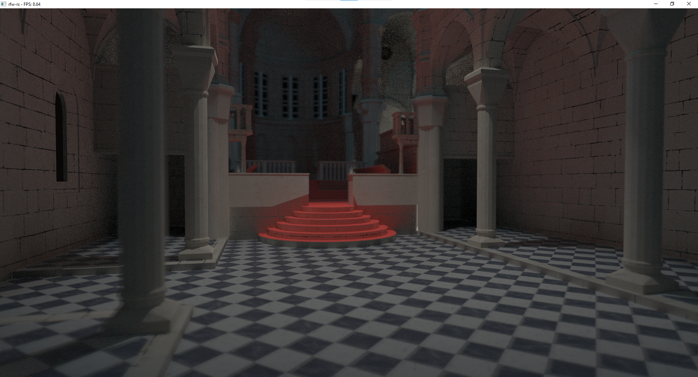

# GPU RT

A GPU-based path tracer that implements:
- Wavefront path tracing
- Direct light sampling/NEE
- Multiple Importance Sampling
- Disney BSDF
- Instancing using top-level BVH
- Spatial BVH & Quad-level MBVH